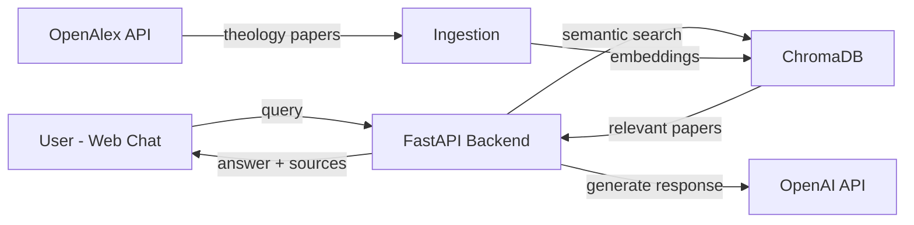

# GRAYSON - Theology & Philosophy Research Assistant

<!--
================================================================================
WHAT THIS FILE IS:
The main documentation file for the GRAYSON project. This is the first thing
visitors see on GitHub.

WHY YOU NEED IT:
- Explains what the project does and why it exists
- Provides setup and usage instructions
- Shows the project structure and architecture
- Helps employers and collaborators understand the project quickly
================================================================================
-->

## Overview

**GRAYSON** is a RAG (Retrieval-Augmented Generation) chatbot focused exclusively on **theology, philosophy, and biblical studies**. It helps researchers, students, and enthusiasts quickly locate and understand academic resources in these fields.

### The Problem

Researchers and students waste hours searching fragmented databases for theology and philosophy papers. University libraries are often outdated, and finding relevant academic sources across multiple platforms is tedious.

### The Solution

GRAYSON centralizes semantic search across theology and philosophy resources, providing:
- Instant access to relevant academic papers
- AI-generated summaries with source citations
- Direct links to OMNI and JSTOR for full-text access
- "Have you considered?" suggestions for related research directions

## Features

- **Theology-Focused Search**: Automatically filters results to philosophy, theology, religion, and biblical studies
- **Semantic Search**: Uses vector embeddings to find conceptually related papers, not just keyword matches
- **Source Citations**: Every response includes clickable links to original sources
- **Library Integration**: Provides direct search links to OMNI and JSTOR
- **"Have You Considered?"**: Suggests related topics to explore after each query
- **Simple Web UI**: Clean chat interface for easy interaction

## Architecture



## Tech Stack

| Component | Technology |
|-----------|------------|
| Language | Python 3.10+ |
| Backend | FastAPI |
| Vector Database | ChromaDB |
| Embeddings | Sentence-Transformers |
| LLM | OpenAI API (optional) |
| Frontend | Vanilla HTML/JS + Tailwind CSS |
| Academic Data | OpenAlex API (filtered to theology/philosophy) |

## Getting Started

### Prerequisites

- Python 3.10 or higher
- OpenAI API key (optional - works without it using placeholder responses)

### Installation

1. Clone the repository:
```bash
git clone https://github.com/yourusername/grayson.git
cd grayson
```

2. Create and activate a virtual environment:
```bash
python -m venv .venv

# Windows
.\.venv\Scripts\activate

# macOS/Linux
source .venv/bin/activate
```

3. Install dependencies:
```bash
pip install -r requirements.txt
```

4. Configure environment variables:
```bash
cp .env.example .env
# Edit .env and add your OpenAI API key (optional)
```

5. Start the backend:
```bash
uvicorn src.main:app --reload --host 0.0.0.0 --port 8000
```

6. Open the frontend:
```
Open frontend/index.html in your browser
```

## Usage

### Ingest Papers

Before querying, ingest some theology papers:

```bash
curl -X POST "http://localhost:8000/ingest" \
  -H "Content-Type: application/json" \
  -d '{"query": "Gospel of John", "max_results": 10}'
```

### Query

Ask a question:

```bash
curl -X POST "http://localhost:8000/query" \
  -H "Content-Type: application/json" \
  -d '{"question": "What is the theological significance of John 1:1?"}'
```

### Response Format

```json
{
  "answer": "Based on the research... **Have you considered?** ...",
  "sources": [
    {"title": "Paper Title", "doi": "https://doi.org/...", "year": 2020}
  ],
  "library_links": {
    "omni": "https://omni.scholarsportal.info/search?q=...",
    "jstor": "https://www.jstor.org/action/doBasicSearch?Query=..."
  }
}
```

## Project Structure

```
grayson/
├── src/                    # Backend source code
│   ├── main.py            # FastAPI application entry point
│   ├── config.py          # Configuration management
│   ├── ingest.py          # Paper ingestion from OpenAlex
│   ├── embeddings.py      # Sentence-transformers wrapper
│   ├── vectorstore.py     # ChromaDB vector database
│   └── llm.py             # LLM client (OpenAI)
├── frontend/              # Web chat interface
│   └── index.html         # Single-page chat UI
├── tests/                 # Test files
├── docs/                  # Documentation
├── .github/               # GitHub Actions CI/CD
├── requirements.txt       # Production dependencies
└── .env.example          # Environment variables template
```

## API Endpoints

| Method | Endpoint | Description |
|--------|----------|-------------|
| GET | `/health` | Health check |
| POST | `/ingest` | Ingest papers from OpenAlex |
| POST | `/query` | Query the knowledge base |

## Contributing

See [CONTRIBUTING.md](CONTRIBUTING.md) for guidelines.

## License

This project is licensed under the MIT License - see [LICENSE](LICENSE) for details.

## Acknowledgments

- OpenAlex for providing open academic metadata
- Sentence-Transformers for embedding models
- ChromaDB for vector storage
- The open-source AI community

## Contact

Steven Polino - Project Creator

---

*GRAYSON: Your AI companion for theology and philosophy research.*
