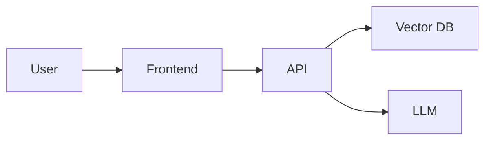

# docs/ - Documentation

<!--
================================================================================
WHAT THIS FILE IS:
README for the docs/ directory explaining the documentation structure.

WHY YOU NEED IT:
- Provides an index to all project documentation
- Helps readers find relevant documentation quickly
- Shows the project is well-documented
- Essential for onboarding and collaboration
================================================================================
-->

## Overview

This directory contains detailed documentation for the GRAYSON project beyond what's in the main README.

## Documentation Files

| File | Purpose |
|------|---------|
| `overview.md` | Comprehensive project overview, goals, and architecture |
| `architecture.md` | Technical architecture documentation and design decisions |

## Document Descriptions

### `overview.md` - Project Overview
A detailed overview of the GRAYSON project including:
- Problem statement and motivation
- Project goals and objectives
- User personas and stories
- High-level architecture diagram
- Component suggestions and choices
- Data flow description
- Testing and evaluation strategy
- Limitations and ethical considerations

### `architecture.md` - System Architecture
Technical documentation covering:
- System design overview
- Architecture diagrams
- Core component descriptions
- Data flow walkthrough
- Design decisions and rationale
- Scalability considerations
- Security considerations

## Contributing to Documentation

When adding or updating documentation:

1. **Use Markdown** - All docs should be in Markdown format
2. **Include Diagrams** - Use Mermaid for diagrams (GitHub renders them)
3. **Keep Updated** - Update docs when code changes
4. **Be Concise** - Write clear, focused documentation
5. **Link Related Docs** - Cross-reference related documentation

## Mermaid Diagrams

GitHub and many Markdown viewers render Mermaid diagrams automatically:

## Related Documentation

- [Main README](../README.md) - Project introduction and quick start
- [CONTRIBUTING.md](../CONTRIBUTING.md) - Contribution guidelines
- [CHANGELOG.md](../CHANGELOG.md) - Version history
