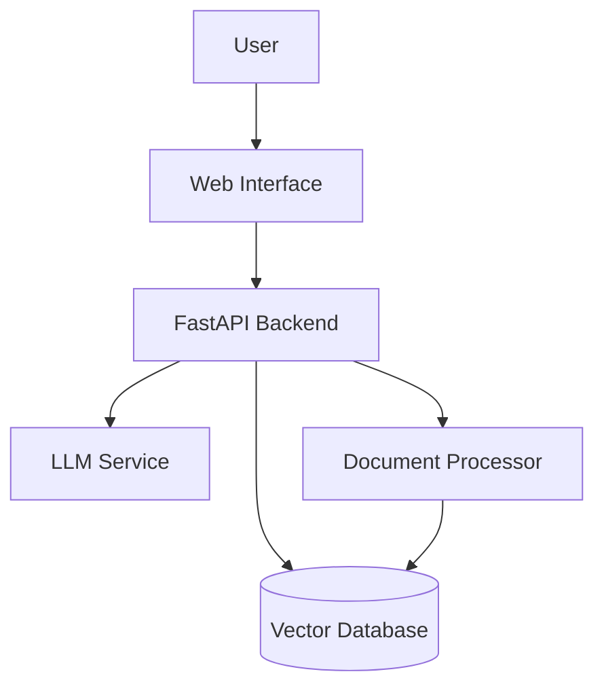

# Architecture

<!--
================================================================================
WHAT THIS FILE IS:
Technical documentation explaining how your system is designed and built.

WHY YOU NEED IT:
- Shows employers you can design systems, not just write code
- Helps future you (and others) understand the codebase
- Demonstrates system design skills (critical for AI engineering roles)
- Differentiates your project from basic tutorials

WHAT TO PUT IN IT:
High-level architecture diagrams, component descriptions, and design decisions.
================================================================================
-->

## System Overview

<!--
Describe your system in 2-3 paragraphs. What problem does it solve?
What's the high-level approach?
-->

## Architecture Diagram

<!--
Include a diagram showing the main components and how they interact.
You can use Mermaid (rendered by GitHub) or an image.

Example Mermaid diagram:

-->

## Core Components

### 1. Document Ingestion Pipeline
<!--
Describe how documents are processed and stored.
- What formats are supported?
- How are documents chunked?
- What embedding model is used?
-->

### 2. Vector Store
<!--
Explain your vector database choice and configuration.
- Why did you choose this database?
- How are embeddings indexed?
- What's the retrieval strategy?
-->

### 3. Retrieval System
<!--
Describe how relevant documents are retrieved.
- What retrieval algorithm is used? (similarity search, hybrid, reranking)
- How many documents are retrieved?
- Any filtering or post-processing?
-->

### 4. LLM Integration
<!--
Explain how you interact with the language model.
- Which model(s) are supported?
- How are prompts structured?
- Any special techniques (chain of thought, few-shot, etc.)?
-->

### 5. API Layer
<!--
Describe the API design.
- What endpoints are available?
- Authentication/authorization approach?
- Rate limiting?
-->

## Data Flow

<!--
Walk through a typical request from start to finish.

Example:
1. User submits a research query
2. Query is embedded using the embedding model
3. Vector store returns top-k similar documents
4. Documents are reranked by relevance
5. Context and query are sent to LLM
6. Response is formatted and returned to user
-->

## Design Decisions

<!--
Document key technical decisions and why you made them.
This shows critical thinking and is great interview material!

Example:

### Why LangChain over LlamaIndex?
We chose LangChain because...

### Why ChromaDB for Development?
For local development, ChromaDB provides...

### Chunking Strategy
We use recursive character splitting with 500-token chunks because...
-->

## Scalability Considerations

<!--
How would this system scale? Shows you think beyond just "it works."
- Horizontal scaling approach
- Caching strategy
- Database scaling
-->

## Security

<!--
Security considerations for AI applications.
- API key management
- Input validation
- Prompt injection prevention
-->
