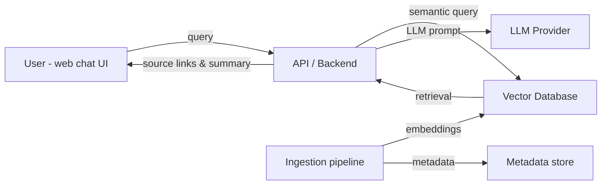

# GRAYSON — Project Overview

<!--
================================================================================
WHAT THIS FILE IS:
Comprehensive project overview including goals, architecture, and data flow.

WHY YOU NEED IT:
- Provides detailed context beyond the main README
- Documents the problem being solved and approach taken
- Helps new contributors understand the project vision
- Shows thoughtful planning and system design
================================================================================
-->

## Project Overview
GRAYSON is an AI Research Assistant (RAG chatbot) that helps researchers locate, summarize, and cite relevant resources from multiple sources (PDFs, web pages, academic papers, public libraries, and YouTube). It creates semantic embeddings of ingested content, stores them in a vector database, and uses those embeddings to provide contextually relevant answers through a web chat interface.

This project integrates the Semantic Scholar API and the Semantic Scholar Open Corpus as primary academic data sources to ensure high-quality, scholarly search results and up-to-date paper metadata.

## Problem Statement
Researchers (especially graduate students) waste time searching across fragmented and outdated resources. GRAYSON centralizes ingestion and semantic search so users can quickly find, summarize, and cite relevant research materials.

## Goals
- Make discovery fast: retrieve high-precision, relevant results across sources.
- Provide concise summaries and citation links for transparency.
- Support incremental ingestion workflows (add new papers, videos, and webpages).
- Offer a simple web chat UI for non-technical users.

## User Personas & Stories
- Persona: PhD student — "As a PhD student, I want to find recent papers about X and get a concise summary with sources so I can cite them in my literature review."
- Persona: Research collaborator — "As a collaborator, I want to upload a PDF and ask targeted questions about methods and results."

## High-level Architecture


## Components & Suggested Choices
- Ingestion: PDF/text parsers, web scrapers, YouTube transcript extractor.
 - Ingestion: PDF/text parsers, web scrapers, YouTube transcript extractor, and Semantic Scholar API/Open Corpus harvesters for academic metadata and full-text links.
- Embeddings: OpenAI embeddings, or open-source alternatives (e.g., SentenceTransformers).
- Vector DB: Chroma / Milvus / Weaviate / Pinecone (choice affects cost and ops).
- LLM: OpenAI, Anthropic, or locally-hosted models depending on cost/privacy.
- API: FastAPI or Flask for the backend.
- Frontend: Simple React app or Streamlit for quick prototypes.
- Storage: File store for raw docs, small relational DB for metadata (SQLite for local dev).

## Data Flow
1. User or automated job uploads a document (PDF/web/YouTube URL).
2. Ingestor extracts text, metadata, and timestamps.
3. Text is chunked and converted to embeddings.
3. Optionally enrich chunks with Semantic Scholar metadata (citation counts, references, DOI, year) to improve ranking and citation reporting.
4. Embeddings + metadata are stored in the vector DB.
4. Embeddings + metadata are stored in the vector DB. Records ingested from Semantic Scholar should include provenance fields (paper id, URL, DOI) to enable citation links.
5. User query triggers retrieval of top-k relevant chunks.
6. Backend constructs a prompt with retrieved context and calls the LLM to produce a summary/answer and includes citations/links.

## Run Locally (example)
```bash
python -m venv .venv
.\.venv\Scripts\activate
pip install -r requirements.txt
# set API keys in .env or environment
python -m src.main
```

## Testing & Evaluation
- Unit tests for ingestion and indexing (pytest).
- Round-trip evaluation: measure retrieval precision@k and LLM answer usefulness on a held-out set.
- Collect user feedback through in-app feedback to improve indexing heuristics.

## Limitations & Ethics
- LLM hallucination risk — always show sources and confidence cues.
- Copyright / scraping concerns — respect robots.txt and terms of service.
- Privacy: Do not send sensitive PDFs to third-party providers without consent.

## Next Steps
- Wire up one vector DB and an embedding provider for a working pipeline.
- Add an ingestion UI and examples in `docs/examples/`.
- Add automated tests for ingestion and retrieval quality.

## Contact
For questions or collaboration: see `CONTRIBUTING.md` and `LICENSE`.
